# Mermaid Diagram Templates

Comprehensive collection of Mermaid diagram templates for technical documentation.

## Table of Contents

- [Architecture Diagrams](#architecture-diagrams)
- [Flowcharts](#flowcharts)
- [Sequence Diagrams](#sequence-diagrams)
- [Class Diagrams](#class-diagrams)
- [State Diagrams](#state-diagrams)
- [Entity Relationship](#entity-relationship)
- [Gantt Charts](#gantt-charts)
- [User Journey](#user-journey)

---

## Architecture Diagrams

### System Overview

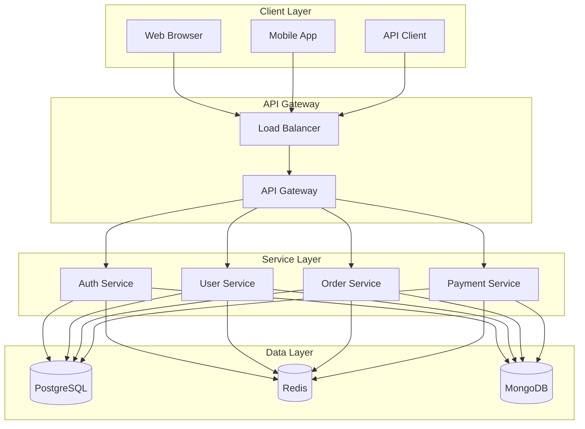
```mermaid
graph TB
    subgraph Client["Client Layer"]
        A[Web Browser]
        B[Mobile App]
        C[API Client]
    end
    
    subgraph Gateway["API Gateway"]
        D[Load Balancer]
        E[API Gateway]
    end
    
    subgraph Services["Service Layer"]
        F[Auth Service]
        G[User Service]
        H[Order Service]
        I[Payment Service]
    end
    
    subgraph Data["Data Layer"]
        J[(PostgreSQL)]
        K[(Redis)]
        L[(MongoDB)]
    end
    
    A & B & C --> D
    D --> E
    E --> F & G & H & I
    F & G & H & I --> J & K & L
```

### Microservices Architecture

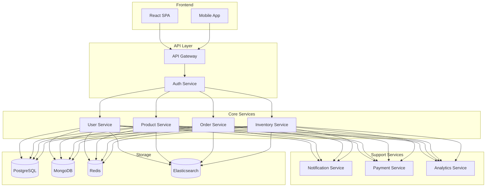
```mermaid
graph TB
    subgraph Frontend["Frontend"]
        A[React SPA]
        B[Mobile App]
    end
    
    subgraph API["API Layer"]
        C[API Gateway]
        D[Auth Service]
    end
    
    subgraph Core["Core Services"]
        E[User Service]
        F[Product Service]
        G[Order Service]
        H[Inventory Service]
    end
    
    subgraph Support["Support Services"]
        I[Notification Service]
        J[Payment Service]
        K[Analytics Service]
    end
    
    subgraph Storage["Storage"]
        L[(PostgreSQL)]
        M[(MongoDB)]
        N[(Redis)]
        O[(Elasticsearch)]
    end
    
    A & B --> C
    C --> D
    D --> E & F & G & H
    E & F & G & H --> I & J & K
    E & F & G & H --> L & M & N & O
```

### Layered Architecture

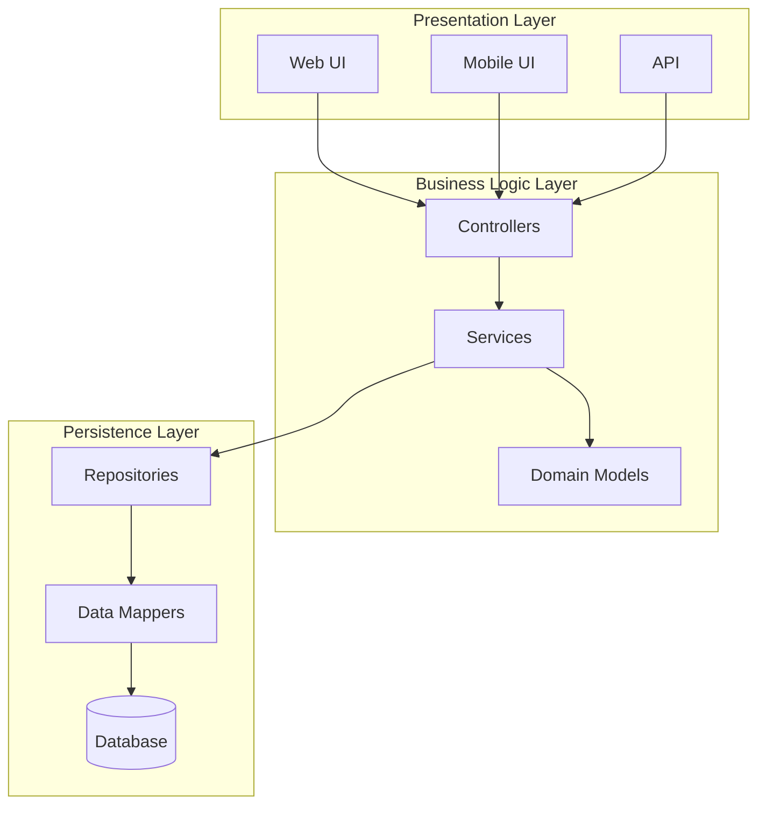
```mermaid
graph TB
    subgraph Presentation["Presentation Layer"]
        A[Web UI]
        B[Mobile UI]
        C[API]
    end
    
    subgraph Business["Business Logic Layer"]
        D[Controllers]
        E[Services]
        F[Domain Models]
    end
    
    subgraph Persistence["Persistence Layer"]
        G[Repositories]
        H[Data Mappers]
        I[(Database)]
    end
    
    A & B & C --> D
    D --> E
    E --> F
    E --> G
    G --> H
    H --> I
```

### Event-Driven Architecture

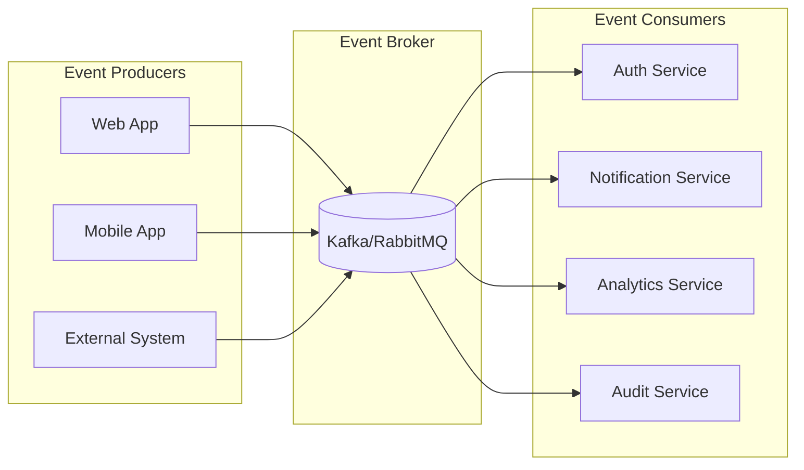
```mermaid
graph LR
    subgraph Producers["Event Producers"]
        A[Web App]
        B[Mobile App]
        C[External System]
    end
    
    subgraph Broker["Event Broker"]
        D[(Kafka/RabbitMQ)]
    end
    
    subgraph Consumers["Event Consumers"]
        E[Auth Service]
        F[Notification Service]
        G[Analytics Service]
        H[Audit Service]
    end
    
    A & B & C --> D
    D --> E & F & G & H
```

---

## Flowcharts

### User Registration Flow

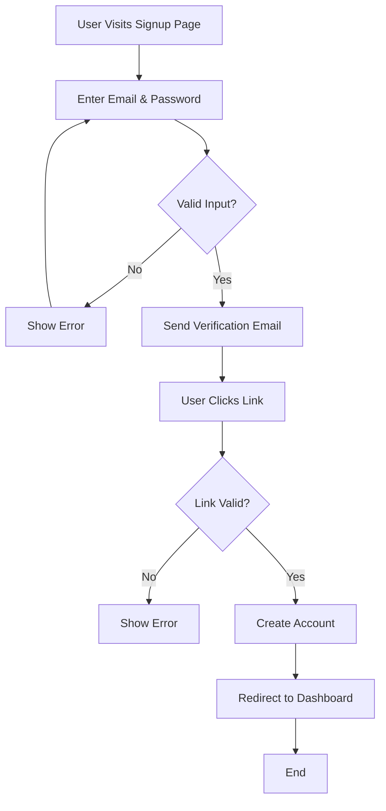
```mermaid
flowchart TD
    A[User Visits Signup Page] --> B[Enter Email & Password]
    B --> C{Valid Input?}
    C -->|No| D[Show Error]
    D --> B
    C -->|Yes| E[Send Verification Email]
    E --> F[User Clicks Link]
    F --> G{Link Valid?}
    G -->|No| H[Show Error]
    G -->|Yes| I[Create Account]
    I --> J[Redirect to Dashboard]
    J --> K[End]
```

### API Request Flow

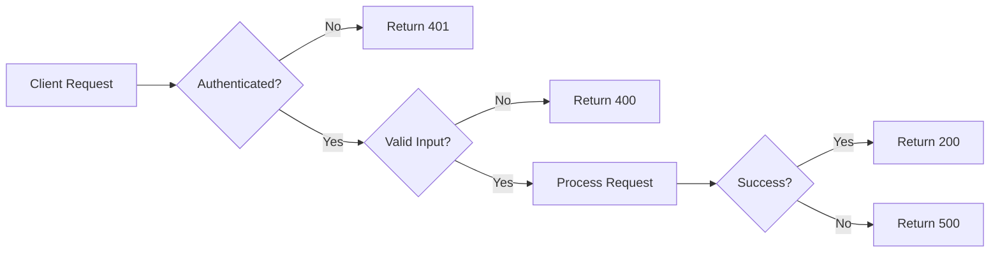
```mermaid
flowchart LR
    A[Client Request] --> B{Authenticated?}
    B -->|No| C[Return 401]
    B -->|Yes| D{Valid Input?}
    D -->|No| E[Return 400]
    D -->|Yes| F[Process Request]
    F --> G{Success?}
    G -->|Yes| H[Return 200]
    G -->|No| I[Return 500]
```

### Deployment Pipeline

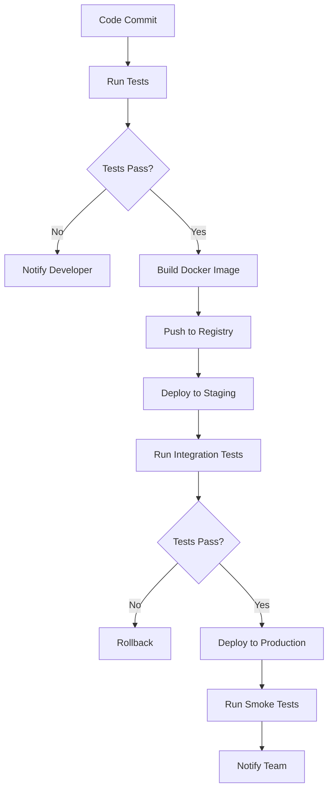
```mermaid
flowchart TD
    A[Code Commit] --> B[Run Tests]
    B --> C{Tests Pass?}
    C -->|No| D[Notify Developer]
    C -->|Yes| E[Build Docker Image]
    E --> F[Push to Registry]
    F --> G[Deploy to Staging]
    G --> H[Run Integration Tests]
    H --> I{Tests Pass?}
    I -->|No| J[Rollback]
    I -->|Yes| K[Deploy to Production]
    K --> L[Run Smoke Tests]
    L --> M[Notify Team]
```

### Decision Tree

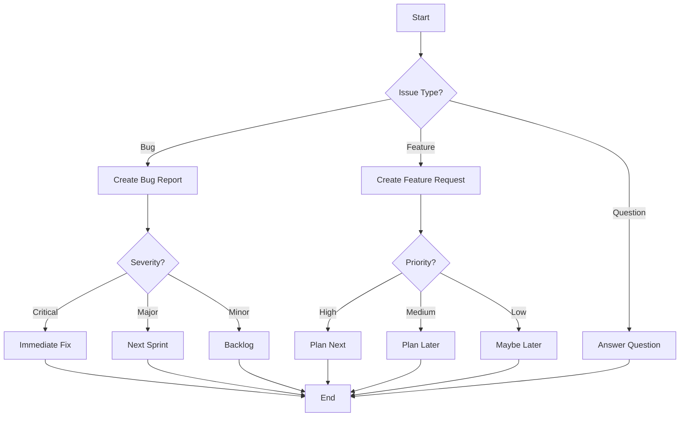
```mermaid
flowchart TD
    A[Start] --> B{Issue Type?}
    B -->|Bug| C[Create Bug Report]
    B -->|Feature| D[Create Feature Request]
    B -->|Question| E[Answer Question]
    
    C --> F{Severity?}
    F -->|Critical| G[Immediate Fix]
    F -->|Major| H[Next Sprint]
    F -->|Minor| I[Backlog]
    
    D --> J{Priority?}
    J -->|High| K[Plan Next]
    J -->|Medium| L[Plan Later]
    J -->|Low| M[Maybe Later]
    
    G & H & I & K & L & M & E --> N[End]
```

---

## Sequence Diagrams

### User Authentication

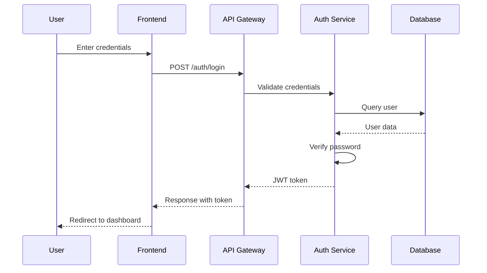
```mermaid
sequenceDiagram
    participant U as User
    participant F as Frontend
    participant A as API Gateway
    participant AS as Auth Service
    participant DB as Database
    
    U->>F: Enter credentials
    F->>A: POST /auth/login
    A->>AS: Validate credentials
    AS->>DB: Query user
    DB-->>AS: User data
    AS->>AS: Verify password
    AS-->>A: JWT token
    A-->>F: Response with token
    F-->>U: Redirect to dashboard
```

### Order Processing

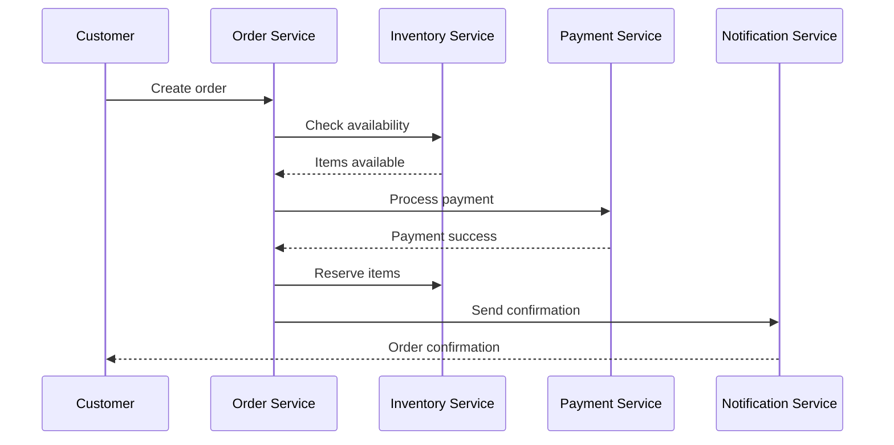
```mermaid
sequenceDiagram
    participant C as Customer
    participant O as Order Service
    participant I as Inventory Service
    participant P as Payment Service
    participant N as Notification Service
    
    C->>O: Create order
    O->>I: Check availability
    I-->>O: Items available
    O->>P: Process payment
    P-->>O: Payment success
    O->>I: Reserve items
    O->>N: Send confirmation
    N-->>C: Order confirmation
```

### Data Sync Process

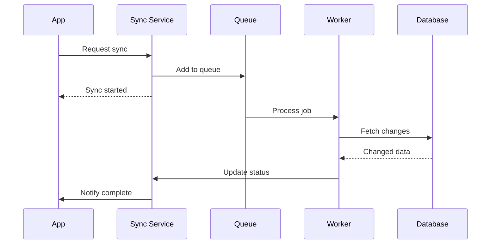
```mermaid
sequenceDiagram
    participant A as App
    participant S as Sync Service
    participant Q as Queue
    participant W as Worker
    participant D as Database
    
    A->>S: Request sync
    S->>Q: Add to queue
    S-->>A: Sync started
    Q->>W: Process job
    W->>D: Fetch changes
    D-->>W: Changed data
    W->>S: Update status
    S->>A: Notify complete
```

---

## Class Diagrams

### User Management

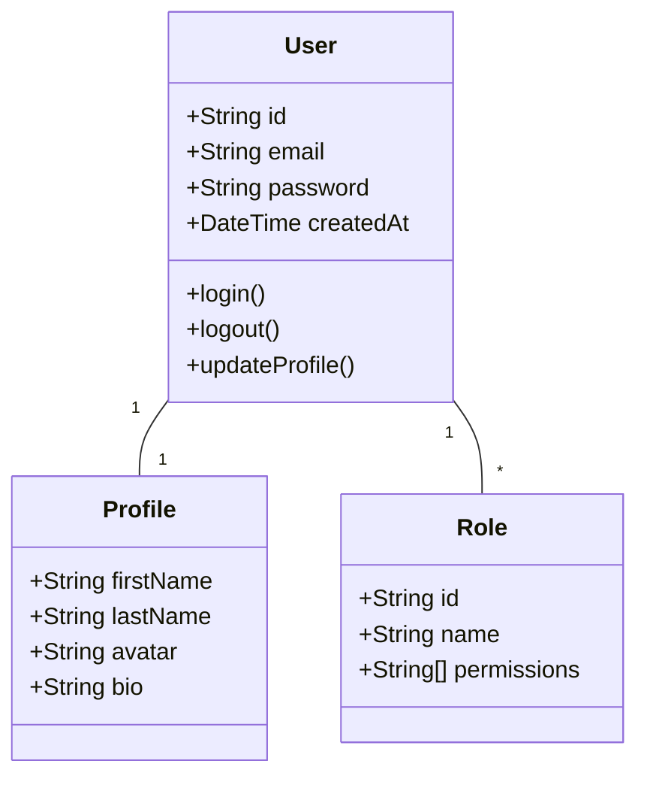
```mermaid
classDiagram
    class User {
        +String id
        +String email
        +String password
        +DateTime createdAt
        +login()
        +logout()
        +updateProfile()
    }
    
    class Role {
        +String id
        +String name
        +String[] permissions
    }
    
    class Profile {
        +String firstName
        +String lastName
        +String avatar
        +String bio
    }
    
    User "1" -- "1" Profile
    User "1" -- "*" Role
```

### E-commerce Domain

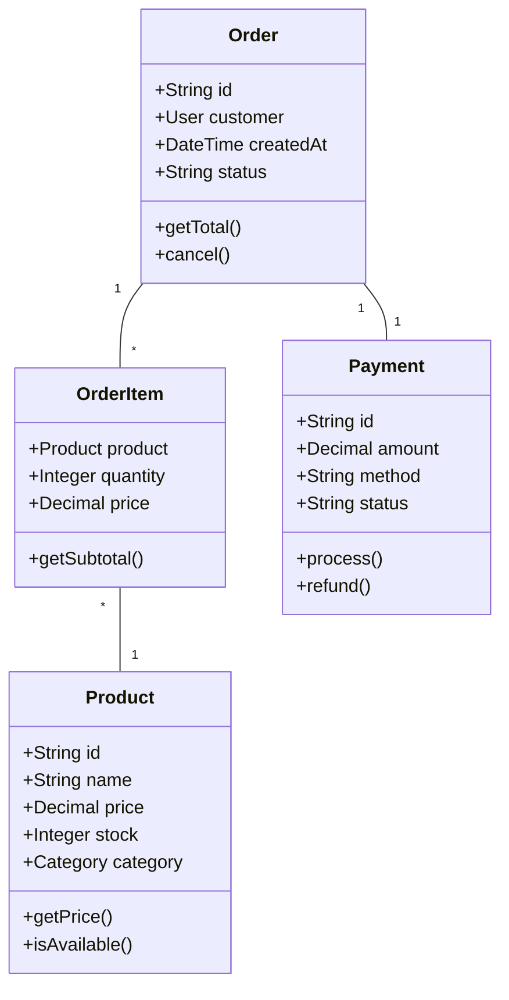
```mermaid
classDiagram
    class Product {
        +String id
        +String name
        +Decimal price
        +Integer stock
        +Category category
        +getPrice()
        +isAvailable()
    }
    
    class Order {
        +String id
        +User customer
        +DateTime createdAt
        +String status
        +getTotal()
        +cancel()
    }
    
    class OrderItem {
        +Product product
        +Integer quantity
        +Decimal price
        +getSubtotal()
    }
    
    class Payment {
        +String id
        +Decimal amount
        +String method
        +String status
        +process()
        +refund()
    }
    
    Order "1" -- "*" OrderItem
    Order "1" -- "1" Payment
    OrderItem "*" -- "1" Product
```

---

## State Diagrams

### Order State Machine

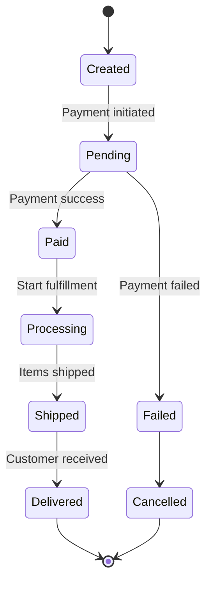
```mermaid
stateDiagram-v2
    [*] --> Created
    Created --> Pending: Payment initiated
    Pending --> Paid: Payment success
    Pending --> Failed: Payment failed
    Paid --> Processing: Start fulfillment
    Processing --> Shipped: Items shipped
    Shipped --> Delivered: Customer received
    Delivered --> [*]
    Failed --> Cancelled
    Cancelled --> [*]
```

### User Account States

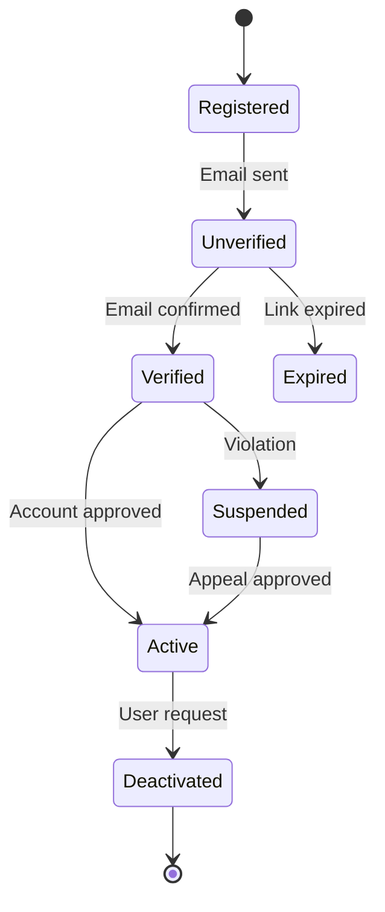
```mermaid
stateDiagram-v2
    [*] --> Registered
    Registered --> Unverified: Email sent
    Unverified --> Verified: Email confirmed
    Unverified --> Expired: Link expired
    Verified --> Active: Account approved
    Verified --> Suspended: Violation
    Suspended --> Active: Appeal approved
    Active --> Deactivated: User request
    Deactivated --> [*]
```

---

## Entity Relationship

### Blog System

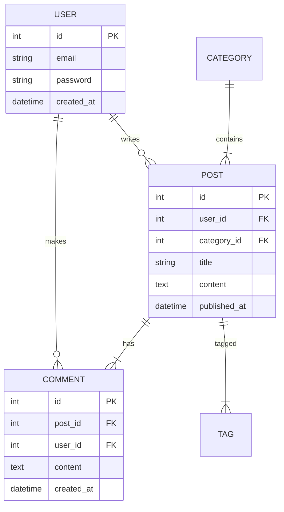
```mermaid
erDiagram
    USER ||--o{ POST : writes
    USER ||--o{ COMMENT : makes
    POST ||--|{ COMMENT : has
    POST ||--|{ TAG : tagged
    CATEGORY ||--|{ POST : contains
    
    USER {
        int id PK
        string email
        string password
        datetime created_at
    }
    
    POST {
        int id PK
        int user_id FK
        int category_id FK
        string title
        text content
        datetime published_at
    }
    
    COMMENT {
        int id PK
        int post_id FK
        int user_id FK
        text content
        datetime created_at
    }
```

### E-commerce ERD

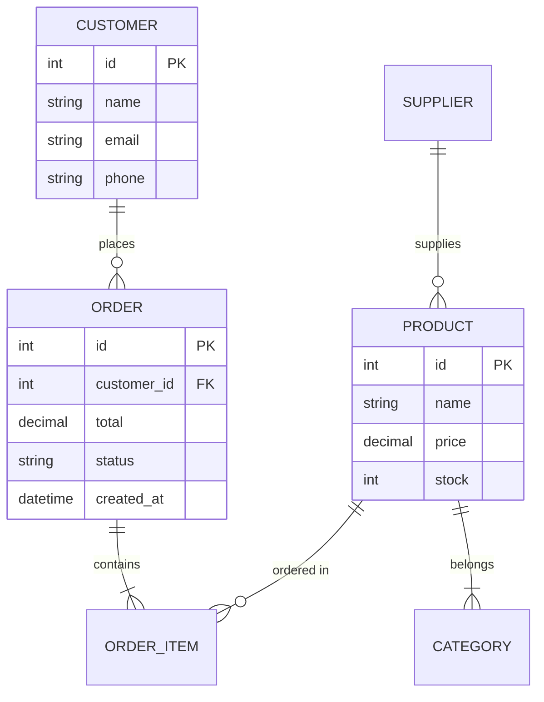
```mermaid
erDiagram
    CUSTOMER ||--o{ ORDER : places
    ORDER ||--|{ ORDER_ITEM : contains
    PRODUCT ||--o{ ORDER_ITEM : "ordered in"
    PRODUCT ||--|{ CATEGORY : belongs
    SUPPLIER ||--o{ PRODUCT : supplies
    
    CUSTOMER {
        int id PK
        string name
        string email
        string phone
    }
    
    ORDER {
        int id PK
        int customer_id FK
        decimal total
        string status
        datetime created_at
    }
    
    PRODUCT {
        int id PK
        string name
        decimal price
        int stock
    }
```

---

## Gantt Charts

### Project Timeline

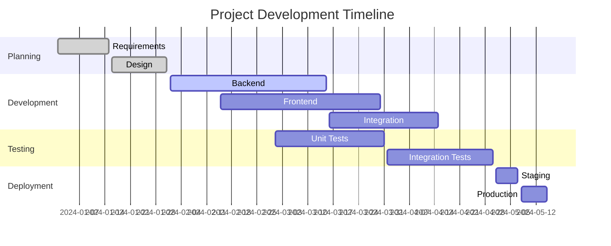
```mermaid
gantt
    title Project Development Timeline
    dateFormat  YYYY-MM-DD
    section Planning
    Requirements       :done,    des1, 2024-01-01, 2024-01-15
    Design            :done,    des2, 2024-01-16, 2024-01-31
    section Development
    Backend           :active,  dev1, 2024-02-01, 2024-03-15
    Frontend          :         dev2, 2024-02-15, 2024-03-30
    Integration       :         dev3, 2024-03-16, 2024-04-15
    section Testing
    Unit Tests        :         test1, 2024-03-01, 2024-03-31
    Integration Tests :         test2, 2024-04-01, 2024-04-30
    section Deployment
    Staging           :         deploy1, 2024-05-01, 2024-05-07
    Production        :         deploy2, 2024-05-08, 2024-05-15
```

### Sprint Plan

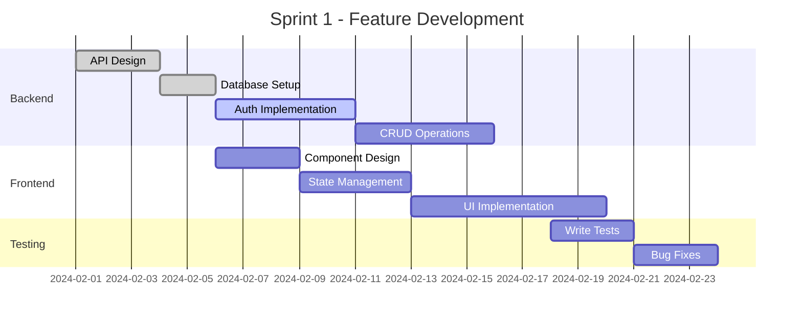
```mermaid
gantt
    title Sprint 1 - Feature Development
    dateFormat  YYYY-MM-DD
    section Backend
    API Design          :done,    api1, 2024-02-01, 3d
    Database Setup      :done,    db1, 2024-02-04, 2d
    Auth Implementation :active,  auth1, 2024-02-06, 5d
    CRUD Operations     :         crud1, 2024-02-11, 5d
    section Frontend
    Component Design    :         fe1, 2024-02-06, 3d
    State Management    :         fe2, 2024-02-09, 4d
    UI Implementation   :         fe3, 2024-02-13, 7d
    section Testing
    Write Tests         :         test1, 2024-02-18, 3d
    Bug Fixes           :         fix1, 2024-02-21, 3d
```

---

## User Journey

### Customer Purchase Journey

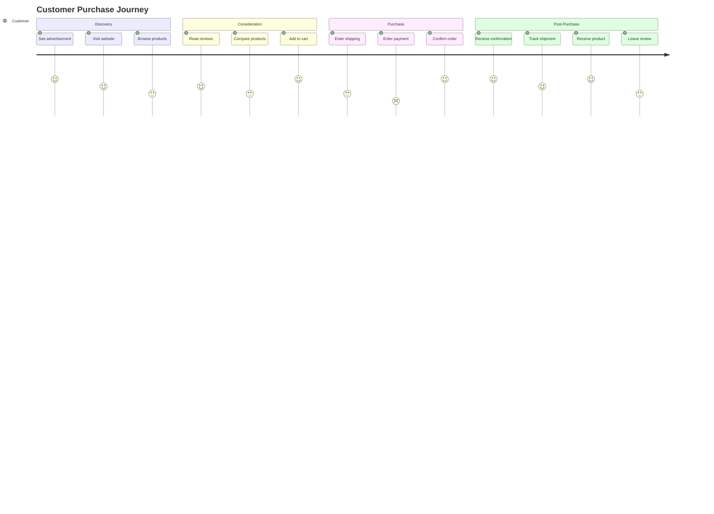
```mermaid
journey
    title Customer Purchase Journey
    section Discovery
      See advertisement: 5: Customer
      Visit website: 4: Customer
      Browse products: 3: Customer
    section Consideration
      Read reviews: 4: Customer
      Compare products: 3: Customer
      Add to cart: 5: Customer
    section Purchase
      Enter shipping: 3: Customer
      Enter payment: 2: Customer
      Confirm order: 5: Customer
    section Post-Purchase
      Receive confirmation: 5: Customer
      Track shipment: 4: Customer
      Receive product: 5: Customer
      Leave review: 3: Customer
```

### User Onboarding

```mermaid
journey
    title New User Onboarding
    section Sign Up
      Create account: 5: User
      Verify email: 4: User
      Complete profile: 3: User
    section First Use
      Take tutorial: 4: User
      Explore features: 5: User
      Import data: 3: User
    section Engagement
      Use core feature: 5: User
      Invite team: 4: User
      Configure settings: 3: User
```

---

## Mind Maps

### Product Features

```mermaid
mindmap
  root((Product))
    Core Features
      Authentication
      User Management
      Data Processing
      Reporting
    Advanced Features
      Analytics
      Integrations
      Automation
      API Access
    Support
      Documentation
      Tutorials
      Community
      Help Desk
```

### Project Structure

```mermaid
mindmap
  root((Project))
    src
      components
      services
      utils
      hooks
    tests
      unit
      integration
      e2e
    docs
      api
      guides
      tutorials
    config
      webpack
      babel
      eslint
```

---

## Pie Charts

### Technology Stack Distribution

```mermaid
pie
    title Technology Stack Distribution
    "Frontend" : 35
    "Backend" : 40
    "Database" : 15
    "DevOps" : 10
```

### Bug Categories

```mermaid
pie
    title Bug Categories
    "UI/UX" : 30
    "Backend" : 45
    "Database" : 15
    "Performance" : 10
```

---

## Usage Tips

### Best Practices

1. **Keep it simple** - Don't overcrowd diagrams
2. **Use consistent styling** - Same colors for same concepts
3. **Add descriptions** - Explain complex relationships
4. **Update regularly** - Keep diagrams in sync with code
5. **Use subgraphs** - Group related elements

### Styling Options

```mermaid
graph LR
    A[Default] --> B[Styled]
    B --> C[Custom]
    
    style B fill:#f9f,stroke:#333,stroke-width:4px
    style C fill:#bbf,stroke:#f66,stroke-width:2px,color:#fff
```

### Responsive Design

- Use `%%{init: {'theme': 'default'}}%%` for theme
- Adjust `direction` for layout (TB, LR, RL, BT)
- Use `subgraph` for grouping
- Keep diagrams under 50 elements for readability

---

## Resources

- [Mermaid Documentation](https://mermaid.js.org/)
- [Mermaid Live Editor](https://mermaid.live/)
- [GitHub Mermaid Support](https://github.blog/2022-02-14-include-diagrams-markdown-files-mermaid/)
