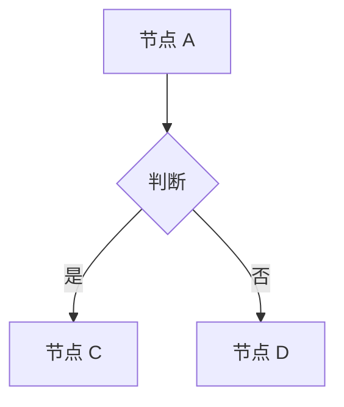
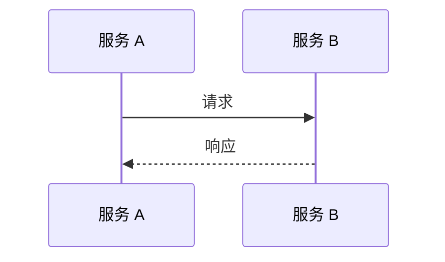
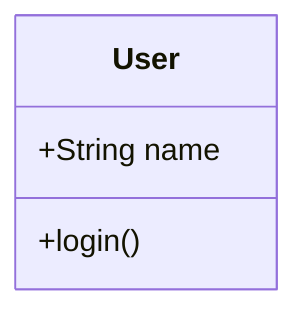
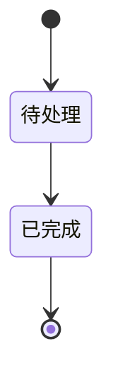
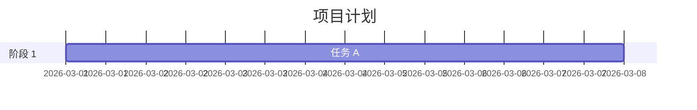
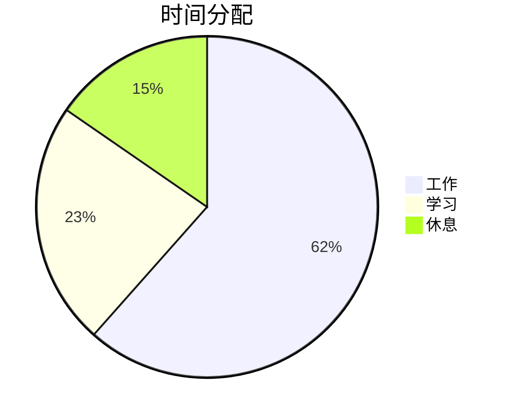

# PPT Generator - 专业演示文稿生成

基于专业前端设计的 HTML 幻灯片生成工具，生成炫酷的科技感演示文稿。

## ✨ 特性

### 🎨 视觉效果
- ✅ 神经网络粒子背景（自动连线）
- ✅ 玻璃拟物卡片（毛玻璃效果）
- ✅ 渐变文字动画
- ✅ 平滑过渡动画
- ✅ 响应式布局（适配各种屏幕）

### 🎮 交互控制
- ✅ 键盘控制（方向键/空格）
- ✅ 鼠标点击（左侧上一页/右侧下一页）
- ✅ 滚轮翻页（带防抖）
- ✅ 触摸滑动（移动端支持）
- ✅ 全屏模式（F11）

### 📱 兼容性
- ✅ 桌面浏览器（Chrome/Firefox/Safari/Edge）
- ✅ 移动设备（iOS/Android）
- ✅ 平板设备（iPad/Android Tablet）
- ✅ 无需服务器（纯 HTML 文件）

## 🚀 快速开始

### 方式 1: 使用 JSON 配置

**1. 创建配置文件**

```json
{
  "title": "我的演示文稿",
  "slides": [
    {
      "type": "title",
      "emoji": "🚀",
      "title": "演示标题",
      "subtitle": "副标题",
      "author": "你的名字",
      "year": "2026"
    },
    {
      "type": "list",
      "title": "课程目标",
      "items": [
        "<span class=\"success\">✓</span> 目标 1",
        "<span class=\"success\">✓</span> 目标 2"
      ]
    }
  ]
}
```

**2. 生成 PPT**

```bash
python3 scripts/generate-ppt.py \
  --config examples/ai-survival-lesson1.json \
  --output output/presentation.html
```

**3. 打开查看**

```bash
# macOS
open output/presentation.html

# Windows
start output/presentation.html

# Linux
xdg-open output/presentation.html
```

---

### 方式 2: 直接修改 HTML

**1. 复制模板**

```bash
cp templates/ppt-template.html my-presentation.html
```

**2. 编辑内容**

在 `<!-- SLIDES_PLACEHOLDER -->` 位置添加幻灯片：

```html
<div class="slide">
    <div class="emoji">🚀</div>
    <h1 class="gradient-text">我的标题</h1>
    <h2>我的副标题</h2>
</div>

<div class="slide">
    <h2>第二页</h2>
    <div class="glass-card">
        <ul>
            <li>内容 1</li>
            <li>内容 2</li>
        </ul>
    </div>
</div>
```

**3. 打开查看**

直接双击 HTML 文件即可！

---

## 📐 幻灯片类型

### 1. 封面页 (title)

```json
{
  "type": "title",
  "emoji": "🚀",
  "title": "主标题",
  "subtitle": "副标题",
  "author": "作者名",
  "year": "2026"
}
```

### 2. 列表页 (list)

```json
{
  "type": "list",
  "title": "页面标题",
  "items": [
    "<span class=\"success\">✓</span> 项目 1",
    "<span class=\"error\">✗</span> 项目 2"
  ]
}
```

### 3. 对比页 (grid)

```json
{
  "type": "grid",
  "title": "对比标题",
  "description": "描述文字",
  "cards": [
    {
      "title": "正面标题",
      "type": "positive",
      "items": ["优点 1", "优点 2"]
    },
    {
      "title": "反面标题",
      "type": "negative",
      "items": ["缺点 1", "缺点 2"]
    }
  ]
}
```

### 4. 金句页 (quote)

```json
{
  "type": "quote",
  "text": "主要文字，",
  "highlight": "强调文字"
}
```

### 5. 任务页 (tasks)

```json
{
  "type": "tasks",
  "title": "行动清单",
  "tasks": [
    {
      "title": "任务标题",
      "desc": "任务描述"
    }
  ]
}
```

### 6. 结束页 (end)

```json
{
  "type": "end",
  "title": "感谢语",
  "subtitle": "副标题",
  "author": "作者名",
  "email": "email@example.com",
  "contact": "微信/电话"
}
```

### 7. Mermaid 图表页 (mermaid) 🆕

```json
{
  "type": "mermaid",
  "title": "图表标题",
  "description": "图表描述",
  "chart": "flowchart",
  "code": "flowchart TD\n    A[开始] --> B{条件？}\n    B -->|是 | C[执行]\n    B -->|否 | D[结束]"
}
```

**支持的图表类型：**

| 类型 | 说明 | 示例 |
|------|------|------|
| `flowchart` | 流程图 | 系统架构、业务流程 |
| `sequenceDiagram` | 时序图 | 接口调用、用户交互 |
| `classDiagram` | 类图 | 领域模型、代码结构 |
| `stateDiagram` | 状态图 | 状态机、订单流转 |
| `gantt` | 甘特图 | 项目计划、时间安排 |
| `pie` | 饼图 | 数据占比、时间分配 |
| `mindmap` | 思维导图 | 知识梳理、头脑风暴 |
| `userJourney` | 用户旅程图 | 用户体验流程 |

**参考示例：** `examples/mermaid-demo.json`

---

## 📊 Mermaid 语法速查

### 流程图 (Flowchart)



### 时序图 (Sequence Diagram)



### 类图 (Class Diagram)



### 状态图 (State Diagram)



### 甘特图 (Gantt)



### 饼图 (Pie)



**完整语法参考：** https://mermaid.js.org/syntax/flowchart.html

---

## 🎨 CSS 类名

### 文字样式

| 类名 | 效果 | 示例 |
|------|------|------|
| `gradient-text` | 渐变文字 | `<h1 class="gradient-text">` |
| `highlight` | 高亮（黄色） | `<span class="highlight">` |
| `success` | 成功（绿色） | `<span class="success">` |
| `error` | 错误（红色） | `<span class="error">` |

### 布局样式

| 类名 | 效果 |
|------|------|
| `glass-card` | 玻璃卡片 |
| `grid-layout` | 网格布局 |
| `quote` | 引用样式 |

---

## 🎮 控制方式

| 操作 | 键盘 | 鼠标 | 触摸 |
|------|------|------|------|
| **上一页** | ← / ↑ | 点击左侧 30% | 向右滑 |
| **下一页** | → / ↓ / 空格 | 点击右侧 30% | 向左滑 |
| **全屏** | F11 | - | - |

---

## 📊 配置示例

### 完整示例

查看 `examples/ai-survival-lesson1.json`

### 自定义颜色

在 HTML 模板中修改 CSS 变量：

```css
:root {
    --bg-color-1: #0f172a;      /* 背景色 1 */
    --bg-color-2: #1e1b4b;      /* 背景色 2 */
    --accent-cyan: #06b6d4;     /* 主色调 */
    --accent-green: #10b981;    /* 成功色 */
    --accent-warning: #f59e0b;  /* 警告色 */
    --accent-danger: #f43f5e;   /* 危险色 */
}
```

---

## 💡 使用场景

### 技术分享
- ✅ 技术大会演讲
- ✅ 团队内部分享
- ✅ 开源项目介绍

### 教育培训
- ✅ 在线课程
- ✅ 企业培训
- ✅ 学校教学

### 项目汇报
- ✅ 项目启动会
- ✅ 进度汇报
- ✅ 结项总结

### 会议演示
- ✅ 产品介绍
- ✅ 方案汇报
- ✅ 客户演示

---

## 🎨 设计亮点

### 1. 神经网络粒子
- 自动连线效果
- 自适应粒子数量
- 流畅 60fps 动画

### 2. 玻璃拟物卡片
- 毛玻璃背景模糊
- 内发光 + 外阴影
- 悬停上浮效果

### 3. 响应式设计
- `clamp()` 响应式字体
- `Grid` 自适应布局
- 移动端优化

### 4. 流畅动画
- `cubic-bezier` 缓动
- 列表延迟入场
- 页面平滑过渡

---

## 📝 最佳实践

### 内容建议
- ✅ 每页不超过 5 个要点
- ✅ 文字简洁有力
- ✅ 多用图表少用字
- ✅ 保持风格统一

### 演示建议
- ✅ 提前测试设备
- ✅ 准备备用方案
- ✅ 控制演示节奏
- ✅ 预留问答时间

### 技术建议
- ✅ 使用 Chrome 浏览器
- ✅ 开启硬件加速
- ✅ 避免过多动画
- ✅ 测试移动端

---

## 🔗 相关链接

- [示例配置](examples/ai-survival-lesson1.json)
- [Mermaid 演示](examples/mermaid-demo.json) 🆕
- [HTML 模板](templates/ppt-template.html)
- [生成脚本](scripts/generate-ppt.py)
- [Mermaid 官方文档](https://mermaid.js.org/)

---

## 🎯 进阶技巧

### 添加自定义动画

```css
@keyframes myAnimation {
    from { opacity: 0; }
    to { opacity: 1; }
}

.my-element {
    animation: myAnimation 1s ease-out;
}
```

### 添加音效

```javascript
function playSound() {
    const audio = new Audio('click.mp3');
    audio.volume = 0.3;
    audio.play();
}

nextSlide();
playSound();
```

### 添加主题切换

```javascript
function toggleTheme() {
    document.body.setAttribute('data-theme', 
        document.body.getAttribute('data-theme') === 'dark' ? 'light' : 'dark'
    );
}
```

---

**🎉 开始制作你的炫酷演示文稿吧！** 🚀
