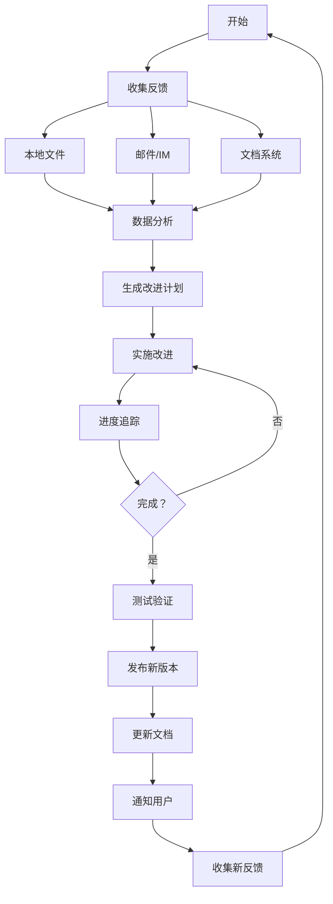

# Skill Manager - 技能管理专家（企业版）

专业的技能管理和持续改进工具，**不依赖 GitHub**，适合企业内部使用。

## 快速开始

```bash
# 收集用户反馈
python3 scripts/collect-feedback.py \
  --skill java-code-review \
  --output 反馈收集.md

# 分析反馈数据
python3 scripts/analyze-feedback.py \
  --files 反馈收集.md 用户反馈.md \
  --output 反馈分析报告.md

# 生成改进计划
python3 scripts/generate-improvements.py \
  --skill java-code-review \
  --feedback 反馈收集.md \
  --output 改进计划.md

# 追踪改进进度
python3 scripts/track-progress.py \
  --plan 改进计划.md \
  --output 进度追踪.md
```

## 核心功能

### 📝 反馈收集（不依赖 GitHub）

| 功能 | 说明 |
|------|------|
| **本地文件** | Markdown/Text 格式反馈 |
| **邮件收集** | 从邮件提取反馈 |
| **IM 导出** | 钉钉/企业微信/飞书导出 |
| **文档系统** | 从 Confluence/语雀导出 |
| **在线表单** | 问卷星/金数据导出 |

### 📊 数据分析

| 功能 | 说明 |
|------|------|
| **趋势分析** | 反馈趋势、类型分布 |
| **优先级分析** | P0/P1/P2/P3 分类 |
| **满意度分析** | 用户满意度统计 |
| **关键发现** | 自动识别关键问题 |

### 🎯 改进计划

| 功能 | 说明 |
|------|------|
| **优先级评估** | P0/P1/P2/P3 分类 |
| **工作量估算** | 天/小时估算 |
| **验收标准** | 明确完成标准 |
| **责任分配** | 明确负责人 |

### 📈 进度追踪

| 功能 | 说明 |
|------|------|
| **实时进度** | 完成百分比 |
| **燃尽图** | 进度趋势可视化 |
| **风险预警** | 延期风险识别 |
| **状态报告** | 自动生成状态报告 |

### 📦 版本管理

| 功能 | 说明 |
|------|------|
| **语义化版本** | SemVer 规范 |
| **变更日志** | 自动生成 CHANGELOG |
| **版本对比** | 对比版本差异 |
| **发布管理** | 发布流程管理 |

## 完整改进流程



## 反馈收集渠道

### 1. 本地文件（推荐）

创建反馈模板，分享给团队成员：

```bash
# 生成反馈模板
python3 scripts/collect-feedback.py \
  --skill java-code-review \
  --output 反馈模板.md

# 团队成员填写后
# 收集所有反馈文件
python3 scripts/analyze-feedback.py \
  --files 反馈模板-张三.md 反馈模板-李四.md \
  --output 汇总分析.md
```

### 2. 邮件收集

从邮件导出反馈：

```markdown
## 反馈内容

**发件人:** zhangsan@company.com  
**时间:** 2026-02-27  
**技能:** java-code-review

### 问题描述
[填写具体问题]

### 影响程度
- [ ] 🔴 无法使用
- [ ] 🟡 影响效率
- [ ] 🟢 轻微影响
```

### 3. IM 收集（钉钉/企业微信/飞书）

从 IM 聊天记录提取：

```markdown
## 反馈内容

**来源:** 钉钉群聊  
**用户:** @张三  
**时间:** 2026-02-27 10:30

### 问题描述
java-code-review 运行时报错...
```

### 4. 文档系统收集

从 Confluence/语雀/飞书文档导出：

```markdown
## 反馈内容

**来源:** 语雀文档  
**文档:** [java-code-review 使用反馈](url)  
**作者:** 张三

### 问题描述
...
```

## 输出示例

### 反馈收集模板

```markdown
# java-code-review 使用反馈

**技能版本:** v1.0  
**反馈时间:** 2026-02-27  
**反馈人:** [你的名字]

---

## 问题反馈

### 问题描述
[详细描述遇到的问题]

### 复现步骤
1. 运行命令：`python3 scripts/review.py --path ./src`
2. 看到输出：[实际输出]
3. 期望输出：[期望输出]

### 环境信息
- Python 版本：3.9
- 操作系统：macOS/Windows/Linux
- 技能版本：v1.0

### 影响程度
- [ ] 🔴 无法使用
- [ ] 🟡 影响效率
- [ ] 🟢 轻微影响

---

## 改进建议

### 建议描述
[详细描述改进建议]

### 使用场景
[描述使用场景]

### 预期收益
- 效率提升：
- 用户体验：

### 实现难度
- [ ] 🟢 简单（<1 天）
- [ ] 🟡 中等（1-3 天）
- [ ] 🔴 复杂（>3 天）
```

### 反馈分析报告

```markdown
# 反馈数据分析报告

**分析时间:** 2026-02-27  
**反馈来源:** 5 个文件  
**总反馈数:** 15 条

## 总体统计

### 反馈类型分布
| 类型 | 数量 | 占比 |
|------|------|------|
| Bug | 6 | 40% |
| 新功能 | 5 | 33% |
| 体验优化 | 4 | 27% |

### 严重程度分布
| 优先级 | 数量 | 占比 |
|--------|------|------|
| P0 严重 | 1 | 7% |
| P1 重要 | 5 | 33% |
| P2 一般 | 9 | 60% |

## 关键发现

### 优势
- ✅ 严重 Bug 少
- ✅ 新功能需求多

### 需改进
- ⚠️ 体验问题较多
```

### 改进计划

```markdown
# java-code-review 改进计划

**生成时间:** 2026-02-27  
**改进周期:** 2026-03 (月度)

## 改进概览

| 优先级 | 数量 | 预计工作量 | 完成时间 |
|--------|------|------------|----------|
| P0 严重 | 1 | 1 天 | 本周 |
| P1 重要 | 5 | 5 天 | 本月 |
| P2 一般 | 9 | 5 天 | 下月 |

## P0 严重问题

### 问题 #1: SQL 注入误报
**负责人:** 张三  
**工作量:** 1 天  
**截止日期:** 2026-03-01

**问题描述:**


**解决方案:**


**验收标准:**
- [ ] 问题修复
- [ ] 添加测试
- [ ] 更新文档
```

### 进度追踪

```markdown
# 改进进度追踪

**更新时间:** 2026-02-27 22:35

## 总体进度

```
总体进度：60%
████████████████████░░░░░░░░░░░░ 9/15
```

| 状态 | 数量 | 占比 |
|------|------|------|
| 待处理 | 6 | 40% |
| 进行中 | 2 | 13% |
| 已完成 | 7 | 47% |

## 风险预警
- 🟢 进度良好
```

## 使用场景

### 场景 1: 团队内部反馈收集

```bash
# 1. 生成反馈模板
python3 scripts/collect-feedback.py \
  --skill java-code-review \
  --output 反馈模板.md

# 2. 分享给团队成员（钉钉/企业微信/飞书）
# 3. 收集团队成员填写的反馈
# 4. 分析反馈
python3 scripts/analyze-feedback.py \
  --files 反馈 - 张三.md 反馈 - 李四.md 反馈 - 王五.md \
  --output 团队反馈分析.md
```

### 场景 2: 月度改进报告

```bash
# 收集本月所有反馈
python3 scripts/analyze-feedback.py \
  --files 2 月/反馈*.md \
  --output 2 月反馈分析报告.md

# 生成改进计划
python3 scripts/generate-improvements.py \
  --skill java-code-review \
  --feedback 2 月反馈分析报告.md \
  --output 3 月改进计划.md
```

### 场景 3: 版本发布前检查

```bash
# 检查所有待解决问题
python3 scripts/track-progress.py \
  --plan 改进计划.md \
  --output 发布前检查.md

# 生成变更日志
python3 scripts/generate-changelog.py \
  --from v1.0 \
  --to v1.1 \
  --output CHANGELOG.md
```

## 企业内部最佳实践

### 1. 建立反馈渠道

**推荐方式：**
- ✅ 钉钉/企业微信群
- ✅ 飞书文档协作
- ✅ 内部邮件列表
- ✅ Confluence/语雀页面
- ❌ GitHub Issues（不适用）

### 2. 定期回顾

**频率建议：**
- **每周:** 检查新反馈（周一）
- **每月:** 生成改进报告（月初）
- **每季度:** 重大版本更新

### 3. 优先级评估

**评估维度：**
- 影响范围（影响多少用户）
- 严重程度（是否阻塞工作）
- 实现难度（工作量）
- 业务价值（ROI）

### 4. 透明沟通

**做法：**
- 在团队群公布改进计划
- 及时更新改进状态
- 完成后@相关人员验收

## 反馈模板

### 简单版（适合 IM）

```
【技能反馈】
技能名：java-code-review
问题类型：Bug/建议
问题描述：[简短描述]
影响程度：高/中/低
```

### 标准版（适合文档）

使用 `collect-feedback.py` 生成的完整模板。

### 邮件版

```
主题：[技能反馈] java-code-review - 问题描述

正文:
技能名称：java-code-review
问题类型：Bug/功能建议
问题描述：
[详细描述]

复现步骤：
1. ...
2. ...

期望结果：
...

实际结果：
...

环境信息：
- Python: 3.9
- OS: macOS
```

## 变更日志模板

```markdown
## [1.1.0] - 2026-03-01

### ✨ 新增
- 新增 SQL 注入检查

### 🐛 修复
- 修复误报问题 (#12)

### ⚡ 优化
- 优化检查速度 50%

### 📝 文档
- 更新使用示例
```

## 最佳实践

详见 [references/best-practices.md](references/best-practices.md)：
- 企业内部反馈收集技巧
- 数据分析方法
- 改进优先级评估
- 进度管理技巧
- 版本管理规范

## 参见

- [OpenClaw 文档](https://docs.openclaw.ai)
- [ClawHub Skills](https://clawhub.com)
