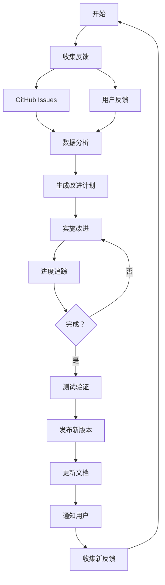

# Skill Manager - 技能管理专家

专业的技能管理和持续改进工具，支持完整的改进闭环。

## 快速开始

```bash
# 收集用户反馈
python3 scripts/collect-feedback.py \
  --skill java-code-review \
  --output 反馈收集.md

# 从 GitHub 自动收集 Issues
python3 scripts/collect-github-issues.py \
  --repo jerry-guo-mys/skills \
  --token YOUR_GITHUB_TOKEN \
  --output github-issues.md

# 分析反馈数据
python3 scripts/analyze-feedback.py \
  --files 反馈收集.md github-issues.md \
  --output 反馈分析报告.md

# 生成改进计划
python3 scripts/generate-improvements.py \
  --skill java-code-review \
  --feedback 反馈收集.md \
  --output 改进计划.md

# 追踪改进进度
python3 scripts/track-progress.py \
  --plan 改进计划.md \
  --output 进度追踪.md
```

## 核心功能

### 📝 反馈收集

| 功能 | 说明 |
|------|------|
| **手动收集** | 使用模板收集用户反馈 |
| **GitHub 集成** | 自动收集 GitHub Issues |
| **多渠道** | 支持邮件、聊天、表单等 |
| **分类整理** | 自动分类问题和蔼议 |

### 📊 数据分析

| 功能 | 说明 |
|------|------|
| **趋势分析** | 反馈趋势、类型分布 |
| **优先级分析** | P0/P1/P2 分布 |
| **满意度分析** | 用户满意度统计 |
| **关键发现** | 自动识别关键问题 |

### 🎯 改进计划

| 功能 | 说明 |
|------|------|
| **优先级评估** | P0/P1/P2/P3 分类 |
| **工作量估算** | 天/小时估算 |
| **验收标准** | 明确完成标准 |
| **责任分配** | 明确负责人 |

### 📈 进度追踪

| 功能 | 说明 |
|------|------|
| **实时进度** | 完成百分比 |
| **燃尽图** | 进度趋势可视化 |
| **风险预警** | 延期风险识别 |
| **状态报告** | 自动生成状态报告 |

### 📦 版本管理

| 功能 | 说明 |
|------|------|
| **语义化版本** | SemVer 规范 |
| **变更日志** | 自动生成 CHANGELOG |
| **版本对比** | 对比版本差异 |
| **发布管理** | 发布流程管理 |

## 完整改进流程



## 输出示例

### 反馈分析报告

```markdown
# 反馈数据分析报告

## 总体统计
总反馈数：25 条

### 反馈类型分布
| 类型 | 数量 | 占比 |
|------|------|------|
| Bug | 10 | 40% |
| 新功能 | 8 | 32% |
| 体验优化 | 7 | 28% |

### 严重程度分布
| 优先级 | 数量 | 响应时间 |
|--------|------|----------|
| P0 严重 | 2 | 24 小时 |
| P1 重要 | 8 | 1 周 |
| P2 一般 | 15 | 1 月 |

## 关键发现
### 优势
- ✅ 无严重 Bug
- ✅ 新功能需求多

### 需改进
- ⚠️ Bug 数量较多
```

### 进度追踪报告

```markdown
# 改进进度追踪

## 总体进度
总体进度：65%
████████████████████░░░░░░░░░░░░ 13/20

| 状态 | 数量 | 占比 |
|------|------|------|
| 待处理 | 7 | 35% |
| 进行中 | 3 | 15% |
| 已完成 | 10 | 50% |

## 风险预警
- 🟡 进度正常，需继续保持
```

## 使用场景

### 1. 日常反馈收集
```bash
python3 scripts/collect-feedback.py \
  --skill java-code-review \
  --output feedback.md
```

### 2. GitHub Issues 管理
```bash
python3 scripts/collect-github-issues.py \
  --repo jerry-guo-mys/skills \
  --token $GITHUB_TOKEN \
  --output issues.md
```

### 3. 月度反馈分析
```bash
python3 scripts/analyze-feedback.py \
  --files feedback-*.md \
  --output monthly-analysis.md
```

### 4. 改进计划制定
```bash
python3 scripts/generate-improvements.py \
  --skill java-code-review \
  --feedback feedback.md \
  --output improvement-plan.md
```

### 5. 进度追踪
```bash
python3 scripts/track-progress.py \
  --plan improvement-plan.md \
  --output progress.md
```

## GitHub 集成

### 获取 Token

1. 访问 https://github.com/settings/tokens
2. 生成新 Token
3. 选择权限：
   - `repo` (私有仓库)
   - `public_repo` (公开仓库)
4. 复制 Token

### 使用 Token

```bash
# 方式 1: 命令行参数
python3 scripts/collect-github-issues.py \
  --repo user/repo \
  --token ghp_xxxxx

# 方式 2: 环境变量
export GITHUB_TOKEN=ghp_xxxxx
python3 scripts/collect-github-issues.py \
  --repo user/repo
```

## 改进优先级

| 优先级 | 说明 | 响应时间 | 示例 |
|--------|------|----------|------|
| **P0** | 严重 Bug | 24 小时 | 技能无法运行 |
| **P1** | 重要问题 | 1 周 | 核心功能缺失 |
| **P2** | 一般问题 | 1 月 | 体验优化 |
| **P3** | 建议 | 待定 | 新功能建议 |

## 报告模板

### 月度改进报告

```markdown
# 技能改进报告 - 2026 年 2 月

## 总体情况
| 技能 | 版本 | 使用次数 | 问题数 | 满意度 |
|------|------|----------|--------|--------|
| java-code-review | v1.1 | 120 | 5 | 4.5/5 |

## 已解决问题 (8)
1. 修复 SQL 注入误报
2. 优化检查速度 50%

## 待改进项 (12)
### P0 (0)
### P1 (2)
### P2 (5)

## 下月计划
1. 完成 P1 改进项
2. 新增 2 个检查规则
```

## 最佳实践

详见 [references/best-practices.md](references/best-practices.md)：
- 反馈收集技巧
- 数据分析方法
- 改进优先级评估
- 进度管理技巧
- 版本管理规范

## 参见

- [OpenClaw 文档](https://docs.openclaw.ai)
- [ClawHub Skills](https://clawhub.com)
