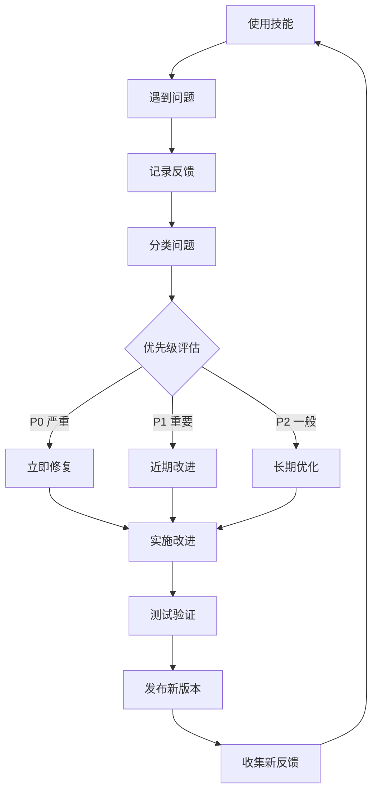

# Skill Manager - 技能管理专家

专业的技能管理和持续改进工具。

## 快速开始

```bash
# 收集使用反馈
python3 scripts/collect-feedback.py \
  --skill java-code-review \
  --output 反馈收集.md

# 生成改进建议
python3 scripts/generate-improvements.py \
  --skill java-code-review \
  --feedback 反馈.md \
  --output 改进建议.md

# 版本对比
python3 scripts/compare-versions.py \
  --old v1.0 \
  --new v1.1 \
  --output 版本对比.md

# 生成改进报告
python3 scripts/improvement-report.py \
  --skills all \
  --output 改进报告.md
```

## 核心功能

### 📝 反馈收集

| 功能 | 说明 |
|------|------|
| **问题记录** | 记录使用中的问题 |
| **建议收集** | 收集改进建议 |
| **满意度评分** | 评估技能满意度 |
| **使用统计** | 统计使用频率 |

### 🎯 改进建议

| 功能 | 说明 |
|------|------|
| **问题分类** | 按类型分类问题 |
| **优先级评估** | 评估改进优先级 |
| **工作量估算** | 估算改进工作量 |
| **改进方案** | 生成改进方案 |

### 📊 版本管理

| 功能 | 说明 |
|------|------|
| **版本追踪** | 追踪版本变更 |
| **变更日志** | 生成 CHANGELOG |
| **版本对比** | 对比版本差异 |
| **回滚支持** | 支持版本回滚 |

### 🧪 自动化测试

| 功能 | 说明 |
|------|------|
| **回归测试** | 确保改进不破坏现有功能 |
| **性能测试** | 测试性能变化 |
| **质量检查** | 检查代码质量 |
| **文档检查** | 检查文档完整性 |

## 改进流程



## 反馈模板

### 问题反馈

```markdown
## 问题反馈

**技能名称:** java-code-review  
**使用场景:** Code Review  
**问题类型:** 🔴 Bug / 🟡 功能缺失 / 🟢 体验优化

### 问题描述
[详细描述遇到的问题]

### 复现步骤
1. 运行命令：`python3 scripts/review.py --path ./src`
2. 看到输出：[实际输出]
3. 期望输出：[期望输出]

### 环境信息
- Python 版本：3.9
- 操作系统：macOS 13.0
- 技能版本：v1.0

### 影响程度
- 🔴 无法使用
- 🟡 影响效率
- 🟢 轻微影响

### 建议解决方案
[如果有，请提供建议]
```

### 改进建议

```markdown
## 改进建议

**技能名称:** java-code-review  
**建议类型:** ✨ 新功能 / 🚀 性能优化 / 📝 文档改进

### 建议描述
[详细描述改进建议]

### 使用场景
[描述使用场景]

### 预期收益
- 效率提升：50%
- 用户体验：显著改善
- 覆盖范围：新增 3 个检查项

### 实现难度
- 🟢 简单（<1 天）
- 🟡 中等（1-3 天）
- 🔴 复杂（>3 天）
```

## 优先级定义

| 优先级 | 说明 | 响应时间 | 示例 |
|--------|------|----------|------|
| **P0** | 严重 Bug | 24 小时 | 技能无法运行 |
| **P1** | 重要问题 | 1 周 | 核心功能缺失 |
| **P2** | 一般问题 | 1 月 | 体验优化 |
| **P3** | 建议 | 待定 | 新功能建议 |

## 版本规范

### 语义化版本

```
主版本号。次版本号。修订号
  ↑      ↑      ↑
 重大变更  新功能  Bug 修复
```

**示例:**
- `v1.0.0` - 初始版本
- `v1.1.0` - 新增功能
- `v1.1.1` - Bug 修复
- `v2.0.0` - 重大变更

### 变更日志格式

```markdown
## [1.1.0] - 2026-02-27

### ✨ 新增
- 新增 SQL 注入检查
- 新增性能问题检查

### 🐛 修复
- 修复误报问题 (#12)
- 修复中文路径问题 (#15)

### 📝 文档
- 更新使用示例
- 新增 FAQ

### ⚡ 优化
- 优化检查速度 50%
```

## 自动化改进

### CI/CD 集成

```yaml
# .github/workflows/skill-test.yml
name: Skill Test

on: [push, pull_request]

jobs:
  test:
    runs-on: ubuntu-latest
    steps:
      - uses: actions/checkout@v3
      - name: Test Skill
        run: |
          python3 scripts/review.py --path ./test-project
          python3 scripts/validate.py
```

### 质量检查

```bash
# 代码质量
python3 -m flake8 scripts/

# 类型检查
python3 -m mypy scripts/

# 测试覆盖
pytest --cov=scripts tests/
```

## 改进报告

### 月度改进报告

```markdown
# 技能改进报告 - 2026 年 2 月

## 📊 总体情况

| 技能 | 版本 | 使用次数 | 问题数 | 满意度 |
|------|------|----------|--------|--------|
| java-code-review | v1.1 | 120 | 5 | 4.5/5 |
| java-debug-helper | v1.0 | 85 | 3 | 4.3/5 |

## 🔴 严重问题 (0)
无

## 🟡 已解决问题 (8)
1. 修复 SQL 注入误报
2. 优化检查速度 50%
...

## 📋 待改进项 (12)
### P0 (0)
### P1 (2)
1. 新增 Oracle 支持
2. 添加配置文件支持
### P2 (5)
...

## 📈 下月计划
1. 完成 P1 改进项
2. 新增 2 个检查规则
3. 优化文档
```

## 最佳实践

详见 [references/best-practices.md](references/best-practices.md)：
- 反馈收集技巧
- 版本管理最佳实践
- 改进优先级评估
- 自动化测试规范

## 参见

- [OpenClaw 文档](https://docs.openclaw.ai)
- [ClawHub Skills](https://clawhub.com)
